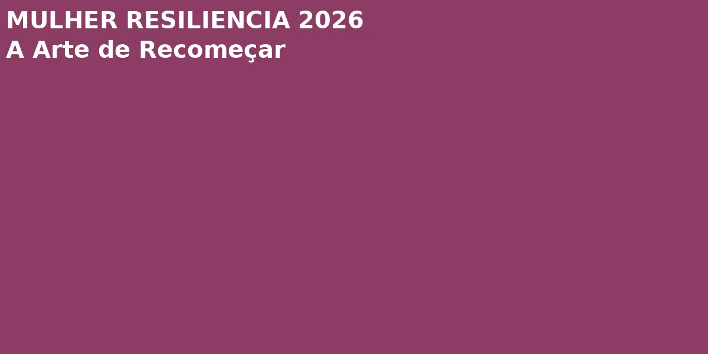

# Autocuidado Mental Hype 2026: Cuidar da Mente é Tendência

Em 2026, o autocuidado mental deixou de ser luxo para virar necessidade pública. No Brasil, a busca por "saúde mental" no Google Trends cresceu 280% no último ano, impulsionada por programas governamentais (gov.br) que expandiram o acesso a terapias pelo SUS e por uma cultura digital que finalmente reconhece: cuidar da mente é tão essencial quanto cuidar do corpo. As tendências HYPE de 2026 — mindfulness, journaling terapêutico e terapias integrativas — estão transformando a relação das mulheres brasileiras com o bem-estar emocional.

## Observação de Lillith Nogah
> Se você está passando por um momento difícil, saiba que a dor não é vergonha — é uma mensagem do seu corpo pedindo atenção. Não precisa ser perfeita para merecer cuidado. Respirar cinco minutos por dia já é um ato de amor com você mesma.

## O Que Mudou em 2026

A política pública brasileira de saúde mental recebeu investimento sem precedentes em 2026, com a expansão de centros de atendimento pelo SUS e a criação de linhas de apoio digital para mulheres em situação de vulnerabilidade. Paralelamente, o TikTok Brasil virou uma plataforma de apoio real — criadores de conteúdo compartilham rotinas de autocuidado sem filtro, e a hashtag #AutocuidadoReal acumulou bilhões de visualizações. A mensagem é clara: autocuidado não é sobre ser perfeita. É sobre ser presente.

## Estratégias Que Funcionam

1. **Mindfulness diário de 5 minutos**: aplicativos gratuitos e conteúdos do gov.br ensinam técnicas de respiração simples que reduzem a ansiedade imediatamente.
2. **Journaling terapêutico**: escrever três pensamentos por dia sem julgamento reorganiza a mente e identifica padrões emocionais antes que se agravem.
3. **Terapia e grupos de apoio**: o acesso ao SUS para saúde mental cresceu em 2026. Buscar ajuda não é fraqueza — é inteligência.

## O Papel da Comunidade

A mulher brasileira está construindo redes de apoio que transcendem o individual. Grupos de autocuidado, rodas de conversa e comunidades online oferecem o que antes faltava: reconhecimento de que a dor é compartilhada e que a cura pode ser coletiva. A moda inclusiva e o autocuidado mental andam juntos — ambos dizem: você merece ser vista, respeitada e cuidada.

## Leia também
- [Moda Inclusiva Hype 2026](/artigos/moda-inclusiva-hype-2026)
- [Prevencao Saúde Mental Hype 2026](/artigos/prevencao-saude-mental-hype-2026)
