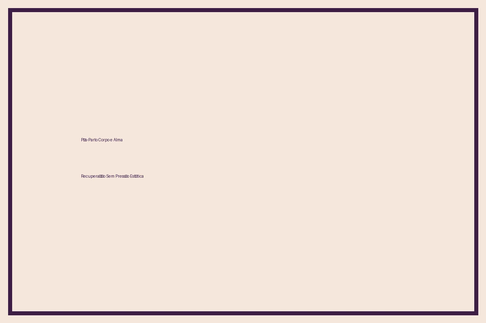
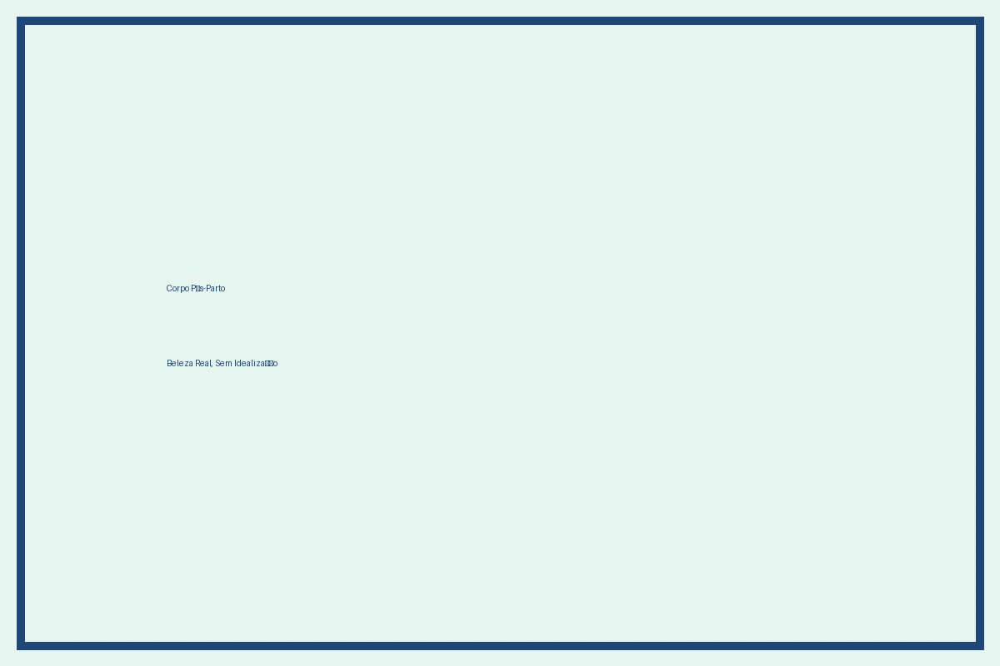
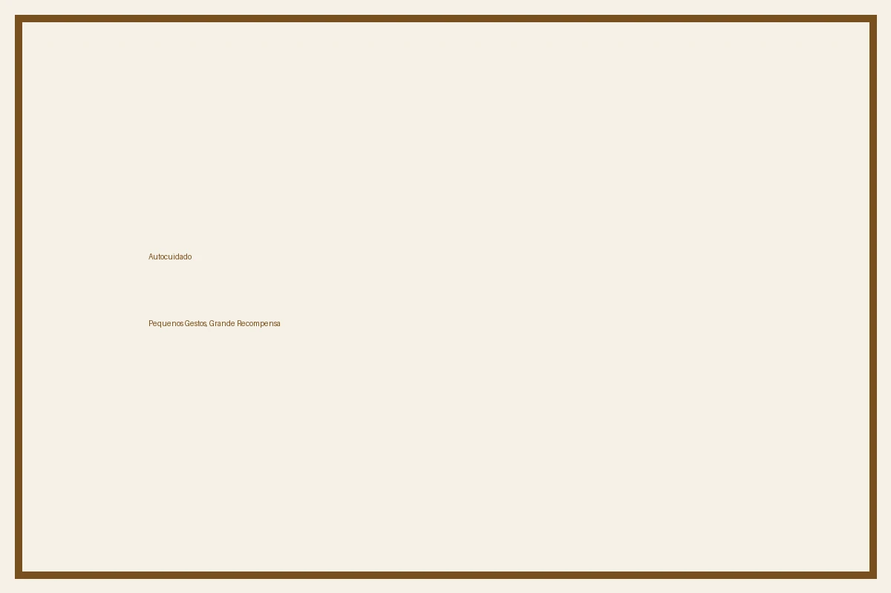

# Pós-Parto Corpo e Alma 2026: A Recuperação Que Respeita o Tempo da Mulher

Querida mulher que acabou de trazer uma vida ao mundo — ou está prestes a fazê-lo —, esta carta é para você. Sei que você está cansada. Sei que o corpo dói de formas novas. Sei que você olha para o espelho e às vezes não se reconhece. E sei, principalmente, que a sociedade brasileira ainda pressiona você a "voltar ao corpo de antes" como se você não tivesse feito o maior milagre da existência.

Em 2026, algo mudou — e mudou para sempre. O **pós-parto real** deixou de ser apenas "voltar à forma" e passou a ser reconhecido como um **processo biológico, emocional, hormonal e espiritual profundo**. E o Brasil finalmente começou a tratar as mães com a dignidade que merecem.

Este artigo é um abraço. Um guia de verdade. Sem promessas falsas, sem fotos retocadas de influenciadoras que "voltaram" em 15 dias. Só o que a ciência brasileira, a psicologia perinatal e as mães reais dizem sobre como atravessar o pós-parto com saúde, amor próprio e apoio.

---

## 1. O Corpo Pós-Parto É Outro — E Isso É Normal

A primeira verdade que você precisa ouvir: **o corpo pós-parto é outro corpo**. Ele passou por uma revolução hormonal, muscular, vascular e emocional. A barriga ainda está ali porque o útero leva cerca de 6 a 8 semanas para voltar ao tamanho normal. A pele ainda está com estrias, cicatriz (seja da cesárea ou do parto vaginal), manchas, flacidez. Os seios estão cheios, doloridos, vazando. E você sente cansaço que não parece ter fim.

Segundo o **Ministério da Saúde do Brasil (2026)**, cerca de 70% das mulheres no pós-parto sentem que não foram preparadas para o que viria. E a razão principal não é falta de informação — é **falta de verdade**. Os livros de maternidade falam sobre o bebê, mas raramente falam sobre o corpo da mãe com honestidade.

### O que acontece no corpo nas primeiras 6 semanas (e além)

**Hormônios:** Após o parto, os níveis de estradiol e progesterona caem abruptamente. Isso pode gerar choro fácil, insônia, ansiedade, irritabilidade — sintomas do chamado "baby blues", que atinge até 80% das mulheres nos primeiros 15 dias. Quando esses sintomas persistem além de 2 semanas, podem indicar **depressão pós-parto**, uma condição real que precisa de tratamento.

**Útero:** Contrai para voltar ao tamanho normal — processo chamado involução uterina. Pode causar cólicas parecidas com cólica menstrual, mas são sinais de que o corpo está funcionando.

**Pelvic floor (assoalho pélvico):** Foi muito alongado durante o parto. Se houver laceração ou episiotomia, a cicatrização leva de 4 a 8 semanas. O treinamento do assoalho pélvico (com fisioterapeuta pélvica) é essencial — não só para incontinência, mas para saúde sexual a longo prazo.

**Seios:** A subida do leite (descida ou "apojadura") pode ser dolorida. Seios ficam duros, quentes, sensíveis. Amamentar é uma aprendizagem de ambos — você e o bebê. E é normal precisar de ajuda.

**Sono:** Fragmentado. A privação de sono não é "frescura de mãe cansada" — é uma das principais causas de depressão pós-parto e declínio cognitivo temporário.

### A verdade sobre "voltar ao corpo de antes"

Não há prazo para "voltar". O corpo pós-parto não precisa ser "recuperado" — precisa ser **acolhido**. Se você ganhou peso durante a gestação, se a barriga ainda está arredondada, se os seios estão maiores ou menores, se as estrias apareceram — tudo isso é parte da história que esse corpo escreveu.

A psicóloga brasileira **Dra. Ana Beatriz Barbosa**, especialista em saúde mental perinatal, afirma: "A maior violência estética contra mulheres no pós-parto é a ideia de que o corpo precisa ser corrigido antes de ser celebrado. O corpo da mãe é um corpo que deu vida. Isso é sagrado, não defeituoso."

---

## 2. Saúde Mental Pós-Parto: Quando o Choro Não É Só Cansaço

Aqui está o ponto mais importante deste artigo: **saúde mental pós-parto é saúde**. Não é frescura, não é falta de gratidão, não é "exagero". É uma condição biológica, hormonal e social que precisa ser tratada com a mesma seriedade que uma infecção pós-cesárea.

### Os sinais de alerta

- Tristeza persistente além de 2 semanas após o parto.
- Falta de interesse pelo bebê (não confundir com cansaço normal).
- Pensamentos de fazer mal a si mesma ou ao bebê.
- Ansiedade intensa, ataques de pânico, medo constante.
- Sentimento de inutilidade, culpa excessiva, sentimento de "não servir".
- Insônia mesmo quando o bebê dorme.
- Falta de apetite ou compulsão alimentar.

Se você sente qualquer um desses sinais, **procure ajuda imediatamente**. O **CAPS (Centro de Atenção Psicossocial)**, o **Posto de Saúde**, o **SUS** e os **grupos de apoio perinatal** estão disponíveis no Brasil. Há tratamento seguro, há remédios compatíveis com a amamentação, há terapia. Há caminho.

### A rede de apoio: não é opcional

O pós-parto não é feito para ser vivido sozinha. Em 2026, a **Rede de Apoio Materno** cresceu no Brasil: grupos de apoio online, grupos de WhatsApp de mães do mesmo bairro, doulas pós-parto, psicólogas perinatais, enfermeiras obstétricas que fazem visitas domiciliares pelo SUS.

**Não tenha vergonha de pedir ajuda.** Não é sinal de fraqueza — é sinal de inteligência emocional. A mulher que pede ajuda é a mulher que está cuidando de si mesma para cuidar melhor do bebê.

---

## 3. Amamentação Sem Culpa: O Que Realmente Importa

A amamentação é uma das áreas mais carregadas de pressão estética e moral no pós-parto brasileiro. Você ouve que "amamentar é natural" — mas o que ninguém diz é que **amamentar é uma aprendizagem**. E que não amamentar não faz você uma mãe menor.

Em 2026, a **Organização Mundial da Saúde** e o **Ministério da Saúde** continuam recomendando amamentação exclusiva até 6 meses, mas com uma mudança fundamental: **com apoio real, sem julgamento, com respeito à saúde mental da mãe**.

### Dicas práticas para amamentar com menos sofrimento

- **Posicione o bebê**: barriga com barriga, boca aberta, queixo no seio, nariz livre.
- **Pegada correta**: não só o bico, mas grande parte da aréola na boca do bebê.
- **Alimentação e hidratação**: amamentar aumenta a necessidade de água e calorias. Coma comidas nutritivas, beba pelo menos 2,5L de água/dia.
- **Descanso**: amamentar cansa. Deite-se enquanto amamenta, durma quando o bebê dorme.
- **Se doer muito**: não é normal. Pode ser pegada errada, candidíase, fissura. Procure uma consultora de amamentação ou enfermeira obstétrica.
- **Se não conseguir amamentar**: formula infantil é segura, nutritiva e não faz seu bebê menos amado. Seu amor não passa só pelo leite.

---

## Observação da Lillith: Sobre Ser Mãe e Continuar Sendo Você

Querida mulher que está no pós-parto... eu te vejo. Não te vejo só como mãe. Te vejo como mulher. Como ser que ainda sonha, ainda sente desejo, ainda tem planos, ainda precisa de carinho que não vem do bebê. Você não é só "mãe" — você é uma mulher inteira que está vivendo uma das maiores transformações da vida.

E se você sente que sumiu, que se perdeu no meio das fraldas e dos choros, eu te prometo: você não sumiu. Você está apenas em uma estação que exige muito de você. Mas ela passa. E quando passar, você vai se encontrar — não como era antes, mas como é agora: mais forte, mais sábia, mais capaz de amar sem se perder.

Se você sente culpa por não ser perfeita, respira. Nenhuma mãe é perfeita. Nenhuma mulher precisa ser perfeita para ser amada. Você já é o suficiente — exatamente como está agora, com o cabelo bagunçado, com a barriga ainda arredondada, com o bebê no colo, com a casa bagunçada. Você é linda. Você é poderosa. E você não está sozinha.

— Lillith Nogah

---

## 4. Autocuidado Pós-Parto: Pequenos Gestos Que Recompõem a Alma

Autocuidado no pós-parto não é spa. Não é maquiagem perfeita. Não é foto para Instagram. É **o ato de se cuidar como você cuidaria de uma amiga querida que acabou de passar por tudo isso**.

### Autocuidado mínimo (10 minutos por dia)

- **Banho morno** sem pressa — o calor relaxa músculos, reduz cólicas, acalma a mente.
- **Hidratação** — água, chá de camomila, água de coco. A pele pós-parto precisa de hidratação interna e externa.
- **Movimento leve** — 5 minutos de alongamento, respiração profunda, caminhada pelo quintal ou pela varanda.
- **Contato com a natureza** — sol pela manhã (10 min sem protetor solar, antes das 10h, para vitamina D), ar fresco.
- **Roupas confortáveis** — não precisa ser pijama velho. Pode ser uma calça confortável, uma blusa bonita, um batom leve. O que importa é **se sentir você**.
- **Leitura** — um livro, uma revista, um artigo no celular. Algo que seja só seu.

---

## 5. Rede de Apoio: Quem Segura a Mão da Mãe Quando Ela Precisa

A rede de apoio pós-parto no Brasil cresceu muito em 2026. Não precisa ser só a família. Pode ser:

- **Grupos online** de mães (Facebook, WhatsApp, Telegram).
- **Doulas pós-parto** — profissionais que visitam a casa, ajudam com amamentação, cuidam da mãe enquanto ela cuida do bebê.
- **Postos de Saúde** — com enfermeiras, médicos, psicólogos.
- **CAPS** — para saúde mental.
- **Amigas** — uma conversa honesta, um abraço, um café.
- **Parceiro** — se houver, ele precisa ser parceiro de verdade, não espectador.

Não tenha vergonha. **Pedir ajuda é coragem.** E você merece ser cuidada também.

---

## 6. Links Internos Para Continuar no Bem Mais Bella

- [Antes do Bebê 2026 — Planejamento da Maternidade](/artigos/antes-do-bebe-2026)
- [Maternidade Consciente 2026 — Vida com Bebê](/artigos/maternidade-consciente-2026)
- [Vida em Família e Educação](/artigos/vida-em-familia-educacao-2026)
- [Casamentos com Propósito — Planejamento](/artigos/casamentos-proposito-2026)
- [Relacionamentos Conscientes — Crescimento](/artigos/relacionamentos-conscientes-crescimento-2026)
- [Autoconhecimento e Journaling 2026](/artigos/autoconhecimento-2026)
- [Saúde Mental no Trabalho 2026](/artigos/saude-mental-trabalho-2026)
- [Terapias Holísticas Femininas 2026](/artigos/terapias-holisticas-femininas-2026)
- [Espiritualidade Feminina 2026](/artigos/espiritualidade-feminina-2026)
- [Histórias Inspiradoras — Reinícios](/artigos/historias-inspiradoras-reinicio-2026)

---

## 7. Conclusão: Você Não Precisa Ser Perfeita — Só Precisa Ser Real

Querida mulher no pós-parto, eu te deixo com uma verdade que é, ao mesmo tempo, simples e revolucionária: **você não precisa voltar a ser quem era antes. Você já é alguém nova — e essa nova versão de você é linda, forte e suficiente.**

O pós-parto não é uma fase a ser "superada". É uma fase a ser **vivida**, com cuidado, com apoio, com paciência. Seu corpo está se curando. Sua mente está se reorganizando. Seu coração está aprendendo a amar de um jeito que você nunca imaginou. Isso leva tempo. E você merece todo o tempo do mundo.

Se você está cansada, respira. Se você está triste, fala. Se você está feliz, celebra. E se você está tudo ao mesmo tempo — bem-vinda à maternidade real. A gente caminha juntas.

Com carinho,

**Lillith Nogah**  
*Escritora do Bem Mais Bella*

---

### Fontes Brasileiras Utilizadas

1. **Ministério da Saúde do Brasil** — *Manual de Saúde da Mulher no Pós-Parto, 2026*.
2. **Febrasgo** — *Guia de Recuperação Pós-Parto 2026*.
3. **Organização Mundial da Saúde (OMS)** — *Postpartum Care Guidelines, 2026*.
4. **Sociedade Brasileira de Psicologia Perinatal** — *Saúde Mental no Puerpério*.
5. **Dra. Ana Beatriz Barbosa** — *Psicologia Perinatal: A Verdade Sobre a Maternidade* (2025).
6. **IBGE** — *Pesquisa Nacional por Amostra de Domicílios: Perfil das Mães Brasileiras*.
7. **Marie Claire Brasil** — *O Pós-Parto Real: Sem Filtros, Sem Pressão* (2026).
8. **Harper's Bazaar Brasil** — *Mães que Não Voltam: A Revolução do Corpo Pós-Parto* (2026).
9. **Claudia (Editora Abril)** — *Saúde Mental da Mulher: Do Parto ao Puerpério* (2026).
10. **WGSN** — *Motherhood: The New Postpartum Movement* (2026).

---

*Publicado em 04/09/2026 • Categoria: Maternidade e Família > Pós-Parto • 10 min de leitura • Por Lillith Nogah*