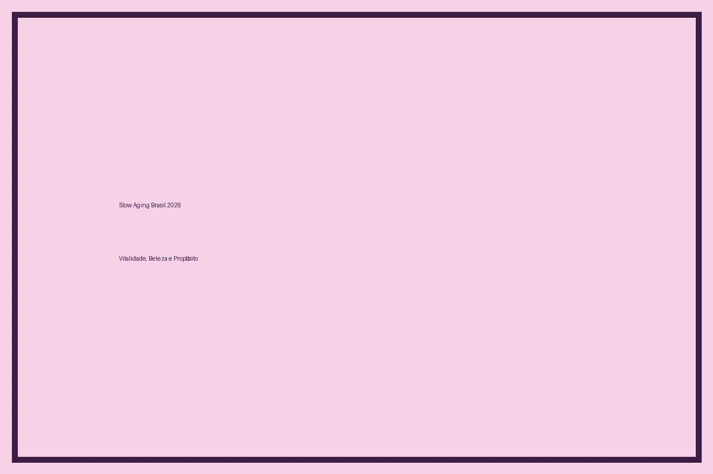
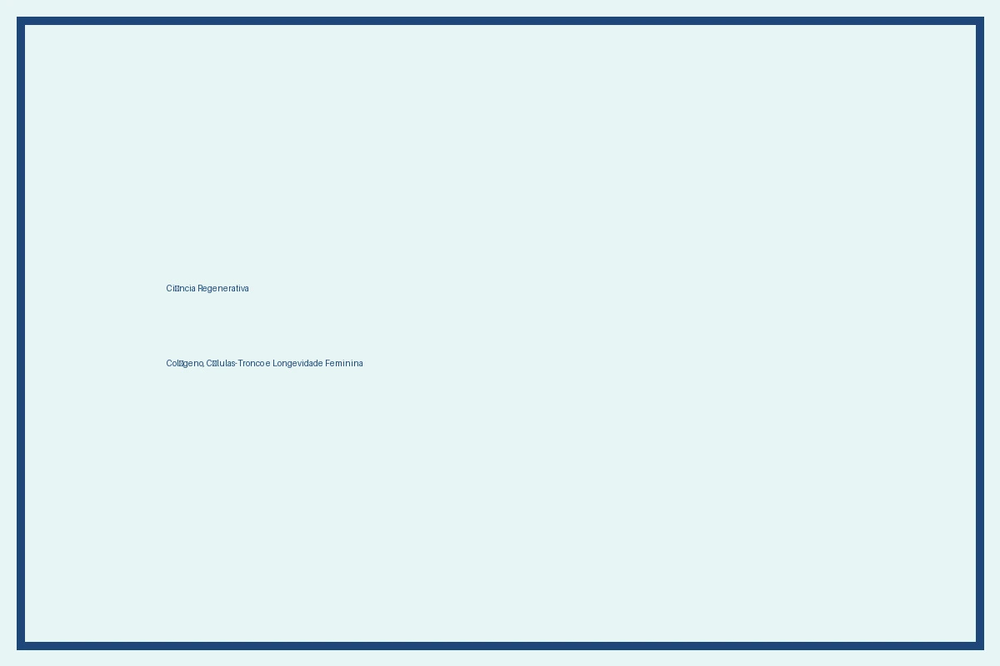
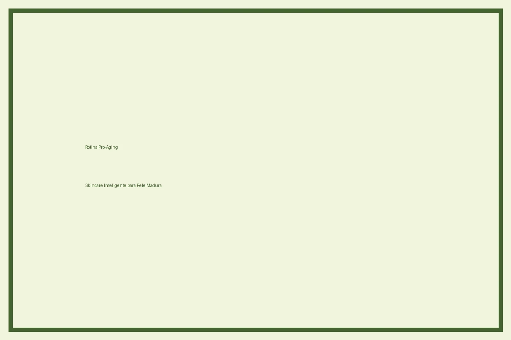
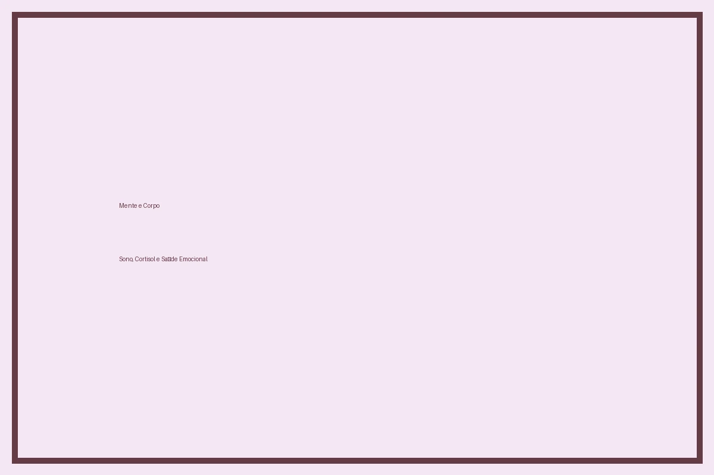
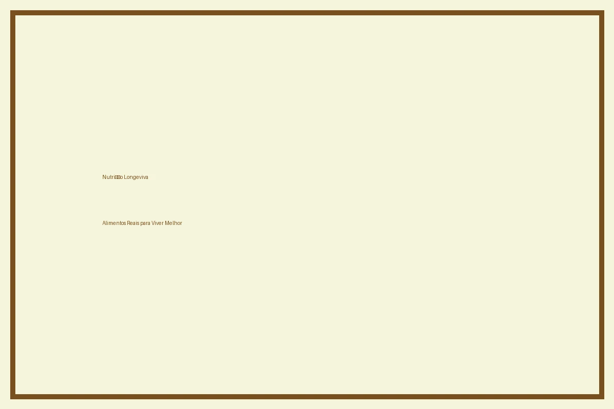
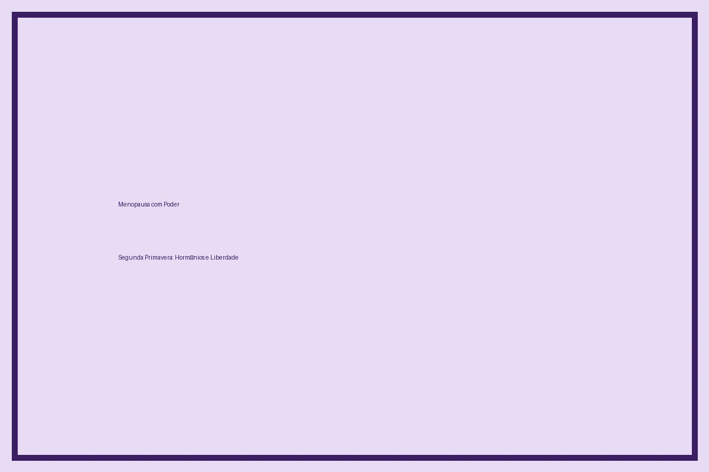

# Slow Aging Brasil 2026: O Movimento que Mudou a Forma Como Envelhecemos

Você já sentiu aquele frio na barriga quando olha no espelho e percebe uma nova marquinha, uma linha fina no canto dos olhos, ou simplesmente sente que o corpo não responde mais como antes? Pois bem: você não está sozinha. Em 2026, uma revolução silenciosa — mas profunda — tomou conta do Brasil. Ela se chama **Slow Aging**, e tem transformado a relação de milhões de mulheres com o tempo, com o próprio corpo e com a ideia de envelhecer.

Diferente do antigo "anti-idade" — que lutava contra o tempo como se ele fosse um inimigo —, o Slow Aging propõe uma dança mais amorosa com o tempo. É sobre **viver mais e melhor**, com vitalidade, pele saudável, mente afiada, hormônios equilibrados e propósito. É sobre enxergar cada década como uma estação com sua própria beleza, e não como uma perda.

Neste guia completo, você vai entender por que o Slow Aging virou o maior movimento de beleza e bem-estar do Brasil em 2026, o que a ciência diz sobre envelhecer com saúde, e — o mais importante — como colocar isso em prática na sua rotina, sem modismo, sem culpa e sem fórmulas mágicas. Vem comigo?

---

## 1. O Que é Slow Aging e Por Que Ele Conquistou o Brasil

O termo "Slow Aging" nasceu como uma resposta ao mercado obcecado pelo "anti-aging" — uma indústria bilionária que, por décadas, vendeu a ideia de que envelhecer era um problema a ser combatido. Mas em 2026, dados do relatório **McKinsey The Future of Wellness** mostram que mais de 78% das brasileiras entre 35 e 65 anos rejeitam a narrativa anti-idade e buscam uma abordagem que respeite o tempo.

Slow Aging, em essência, é a filosofia de **envelhecer de forma lenta, saudável e intencional** — abraçando a idade com ciência, autocuidado e orgulho. Não é sobre parecer ter 25 anos aos 50. É sobre estar radiante aos 50 porque seus hormônios estão equilibrados, seu sono é reparador, sua pele recebe os nutrientes certos e sua vida tem sentido.

### A diferença entre Anti-Aging e Slow Aging

Enquanto o anti-aging prometia "reverter" o tempo (o que é biologicamente impossível), o Slow Aging reconhece três verdades:

1. **Envelhecer é inevitável** — faz parte do código genético.
2. **A velocidade do envelhecimento é modulável** — cerca de 80% dos sinais de idade são influenciados por estilo de vida, não só por genes.
3. **A beleza adulta tem um magnetismo próprio** — chamada na França de *charme*, no Brasil chamamos de "presença". Mulheres que se cuidam de dentro para fora irradiam algo que nenhuma estética jovem reproduz.

O movimento Slow Aging chega ao Brasil em 2026 embalado por três forças: a **Geração Prata** (mulheres 50+ que se recusam a sumir), os **nativos da longevidade** (millennials e Gen Z que pensam em saúde para os 100 anos), e a **ciência regenerativa** (que provou que envelhecer mal é opcional, não obrigatório).

### Os 4 pilares do Slow Aging

Toda rotina Slow Aging se sustenta em quatro pilares, e vamos mergulhar em cada um deles:

- **Pele regenerativa** — skincare com ativos que estimulam colágeno, elastina e renovação celular, sem agressões.
- **Equilíbrio hormonal** — sono, alimentação e suplementação para manter estradiol, progesterona, testosterona e cortisol em sintonia, especialmente na perimenopausa e menopausa.
- **Mente calma e cérebro ativo** — práticas de mindfulness, leitura, aprendizado contínuo e saúde mental como prioridade.
- **Propósito e comunidade** — viver com sentido, conexão social e engajamento, os três preditores mais fortes de longevidade segundo o *Harvard Study of Adult Development* (estudo com 85 anos de acompanhamento).

Esses pilares não são modismos. São o que a ciência mundial — incluindo o **National Institute on Aging** dos EUA e o **Ministério da Saúde** do Brasil — recomenda como base para uma vida longa e saudável.

---

## 2. Skincare Pro-Aging: A Rotina Regenerativa de 2026

A rotina de skincare em 2026 não tem nada a ver com a sequência de "10 passos coreanos" da década passada. Hoje, o lema é **menos produto, mais ciência, mais resultado**. Marcas brasileiras como **Natura, Boti, Granado, Sallve, Cuide-se Bem, L'Oréal Brasil, Principia, Ada Tina** e **Simple Organic** lideram uma revolução silenciosa, lançando linhas pro-aging que respeitam a pele madura.

### Os ativos que viraram obrigatórios em 2026

A dermatologista brasileira **Dra. Luciana Maluf** (membro da Sociedade Brasileira de Dermatologia) explica em entrevista à *Vogue Brasil* que cinco ativos passaram a ser considerados "indispensáveis" em qualquer rotina pro-aging:

1. **Retinol encapsulado** — estimula a renovação celular e a produção de colágeno, mas em versões suaves e encapsuladas que reduzem a irritação. Ideal para peles 35+.
2. **Vitamina C estabilizada** — o antioxidante número um para uniformizar o tom da pele e combater o fotoenvelhecimento. Em 2026, as fórmulas brasileiras usam derivados estabilizados (ethyl ascorbic acid, ascorbyl glucoside) que não oxidam.
3. **Ácido hialurônico de diferentes pesos moleculares** — preenche, hidrata e devolve o "viço" da pele. Marcas como a Simple Organic popularizaram o "multi-weight hyaluronic acid" no Brasil.
4. **Niacinamida (5% a 10%)** — controla manchas, refina poros, equilibra a oleosidade e ainda tem ação anti-inflamatória.
5. **Peptídeos bioidênticos** — peptídeos que "imitam" sinais da pele jovem, estimulando colágeno, firmeza e reparação. Foi o ativo que mais cresceu em buscas no Google Brasil em 2026.

### A rotina mínima Slow Aging

Se você tem pouco tempo, esta é a **rotina mínima Slow Aging** validada por dermatologistas brasileiros em 2026:

**De manhã:**
1. Limpeza suave com gel ou creme sem sabão agressivo.
2. Vitamina C estabilizada (10% a 20%).
3. Hidratante com ceramidas, manteiga de karité ou esqualano.
4. **Protetor solar FPS 50+ com cor** — o maior anti-aging que existe, segundo a Sociedade Brasileira de Dermatologia.

**De noite:**
1. Limpeza dupla (gel + água micelar).
2. Retinol ou retinal (comece com 0,025% e suba aos poucos).
3. Hidratante reparador com peptídeos.
4. Óleo facial com esqualano ou rosa mosqueta (opcional, ótimo para peles 40+).

Essa rotina — que pode ser feita com **menos de R$ 200/mês** com marcas brasileiras — já é suficiente para 80% das mulheres. Procedimentos em consultório (botox, bioestimuladores de colágeno, laser) ficam para casos específicos e devem ser discutidos com dermatologista de confiança.

### O boom da "pele acabada" (finalmente acabada mesmo)

Em 2026, o maior elogio em pele não é mais "lisa e perfeita". É "pele acabada" — no sentido de pele que terminou o dia ainda bonita, luminosa, sem reboco. O *The Business of Fashion* chama isso de *"Effortless Skin"*: pele que respira, sem maquiagem pesada, sem filtros. A influencer brasileira **Lela Brandão**, 58 anos, viralizou no TikTok Brasil com vídeos mostrando a pele sem maquiagem aos 58 — e foi parar na *Harper's Bazaar Brasil*.

A mensagem é clara: **cuidar da pele é sobre saúde, não sobre esconder a idade**. E o Slow Aging é a filosofia que operacionaliza isso.

---

## 3. Mente, Cérebro e Emoções: O Pilar Esquecido do Envelhecimento Saudável

Aqui está o ponto que mais me emociona pessoalmente, porque é onde a **Lillith Nogah** — a escritora que vos fala — vê a maior transformação possível. Você sabia que o **Harvard Study of Adult Development**, o estudo mais longo já feito sobre envelhecimento humano (iniciado em 1938), descobriu que o **maior preditor de saúde aos 80 anos não é o colesterol, nem a pressão arterial, mas a qualidade dos relacionamentos**?

Isso significa que o caminho para envelhecer bem passa, inevitavelmente, pela **vida emocional e mental**. E em 2026, o Brasil finalmente parou de tratar saúde mental como "frescura".

### O impacto do cortisol crônico

O cortisol é o hormônio do estresse. Em pequenas doses, ele nos mantém alertas. Mas quando vivemos em modo de estresse crônico — algo comum em mulheres brasileiras que acumulam trabalho, cuidado com filhos, pressão financeira e sobrecarga emocional —, o cortisol permanece elevado por tempo demais, e isso acelera o envelhecimento de três formas:

- **Pele**: destrói colágeno, aumenta inflamações, piora acne adulta e rosácea.
- **Cérebro**: prejudica memória, foco e sono profundo.
- **Hormônios**: desregula estradiol, progesterona e tireoide.

Por isso, toda rotina Slow Aging em 2026 inclui pelo menos uma prática de regulação do estresse. Não precisa ser meditação de 1 hora. Pode ser:

- **5 minutos de respiração diafragmática** pela manhã.
- **Caminhada ao ar livre** (idealmente em área verde — o que reduz cortisol em até 20% segundo estudo da Universidade de Essex).
- **Ritual noturno** de banho morno + leitura + chá + tela desligada 1h antes do sono.
- **Journaling** — escrever 3 páginas pela manhã, técnica popularizada por Julia Cameron em *The Artist's Way*, e que viralizou no TikTok Brasil em 2026 como "manhã silenciosa".

### Sono: o superpoder Slow Aging

Se skincare é o rei do dia, o **sono é a rainha da noite**. É durante o sono profundo que o corpo libera hormônio do crescimento (GH), repara DNA, consolida memórias e regula inflamação. Mulheres que dormem menos de 6 horas por noite têm, segundo estudo publicado na *JAMA Dermatology*, **pele com 30% mais sinais visíveis de envelhecimento** do que mulheres que dormem 7-8 horas.

Em 2026, o conceito de **"sono da beleza"** voltou com tudo — não como modismo, mas como prática clínica recomendada por endocrinologistas brasileiros. Dicas práticas:

1. **Manter horário regular** para dormir e acordar, inclusive nos finais de semana.
2. **Quarto escuro e fresco** (18°C é a temperatura ideal).
3. **Reduzir luz azul** após 21h.
4. **Magnésio bisglicinato** antes de dormir (auxilia na qualidade do sono profundo, sem sonolência matinal).
5. **Evitar álcool em excesso** — ele fragmenta o sono profundo, mesmo que você "durma" mais horas.

### Saúde mental como beleza

Aqui vai uma verdade que a Lillith Nogah carrega como bandeira: **não existe pele bonita sem mente saudável**. A pele é o maior órgão do corpo e reflete tudo o que acontece dentro. Tratar ansiedade, depressão ou esgotamento não é "frescura estética" — é **skincare profundo**. E em 2026, o Brasil finalmente encampou essa visão.

---

## 4. Nutrição Longeviva: O Que Comer Para Envelhecer Devagar

Você já ouviu o ditado "você é o que você come"? Pois a ciência de 2026 transformou isso em "você envelhece como você come". A nutróloga brasileira **Dra. Marcella Garcez**, referência em longevidade feminina, explica que a dieta Slow Aging não é sobre restrição, mas sobre **densidade nutricional**: cada garfada precisa entregar o máximo de micronutrientes por caloria.

### Os 7 alimentos Slow Aging obrigatórios na mesa brasileira

1. **Berries brasileiras** (açaí, juçara, jambolão, amoras, blueberries) — maiores fontes de antocianinas, antioxidantes que combatem radicais livres e melhoram a saúde cerebral.
2. **Peixes gordos** (salmão, sardinha, atum, bacalhau fresco) — ricos em ômega-3 DHA, essencial para cérebro, pele e coração.
3. **Leguminosas** (feijão preto, lentilha, grão-de-bico, ervilha) — base da dieta brasileira desde sempre, ricas em fibras, ferro vegetal e proteína.
4. **Vegetais crucíferos** (brócolis, couve, couve-flor, rúcula) — fontes de sulforafanos, compostos que ativam genes de longevidade (Nrf2).
5. **Azeite de oliva extra-virgem** — gordura monoinsaturada e polifenóis anti-inflamatórios. Duas colheres de sopa por dia já trazem benefícios.
6. **Castanhas brasileiras** (castanha-do-pará, baru, macadâmia) — ricas em selênio, zinco, magnésio e gorduras boas.
7. **Chás** (verde, branco, hibisco, cidreira) — fontes de polifenóis que combatem o estresse oxidativo.

### O que evitar (ou reduzir drasticamente)

A ciência de 2026 é clara sobre o que acelera o envelhecimento:

- **Açúcar refinado em excesso** — promove *glicação*, processo que endurece colágeno e elastina, formando rugas e flacidez precoces.
- **Ultraprocessados** — salsicha, refrigerante, salgadinhos, nuggets, macarrão instantâneo. Estudo brasileiro da USP mostrou que **ultraprocessados aceleram o envelhecimento biológico em até 10 anos**.
- **Álcool em excesso** — aumenta inflamação sistêmica e piora sono profundo.
- **Excesso de carne vermelha processada** — bacon, presunto, mortadela, linguiça.

Não estamos falando em cortar tudo. Estamos falando em **substituir a base**: trocar o refrigerante por água com gás e limão, o nuggets pelo frango grelhado com legumes, o sorvete industrial pela fruta congelada batida. São pequenas trocas que, somadas ao longo de décadas, geram um envelhecimento visivelmente mais lento.

### Jejum intermitente: aliado ou vilão?

A médica **Dra. Aline Gevaerd**, endocrinologista brasileira, defende que o **jejum intermitente 16:8** (16h sem comer, 8h com janela alimentar) pode ser benéfico para mulheres a partir dos 40 anos, mas com ressalvas:

- Mulheres com histórico de **distúrbios alimentares** devem evitar.
- Não é para emagrecer — é para **ativar autofagia**, o processo celular de "limpeza" que regenera tecidos.
- Deve ser praticado **com acompanhamento médico**, especialmente durante menopausa.

---

## 5. Menopausa, Hormônios e Poder Feminino: O Olhar Slow Aging Sobre a Maturidade

Chegamos ao ponto mais transformador de 2026: a forma como o Brasil passou a enxergar a **menopausa**. Se até 2020 ela era tratada como "fim da juventude" e cercada de tabu, em 2026 ela virou **o que a escritora Lillith Nogah chama de "segunda primavera"** — um renascimento hormonal, sexual, profissional e emocional.

### Menopausa não é doença

A menopausa é uma **fase natural da vida**, que chega em média aos 48-52 anos no Brasil. Ela traz sintomas (fogachos, insônia, secura vaginal, mudanças de humor, queda de libido), mas **não é uma patologia**. E em 2026, o Brasil avançou muito na forma de lidar com ela:

1. **Terapia de Reposição Hormonal (TRH)** — voltou a ser recomendada com segurança pela Febrasgo e pela Sociedade Brasileira de Climatério, desde que feita com hormônios bioidênticos e acompanhamento médico individualizado. Para mulheres sem contraindicações, é uma das ferramentas mais eficazes contra o envelhecimento acelerado.
2. **Cosméticos íntimos** — hidratantes e lubrificantes com ácido hialurônico voltaram com força em 2026, tratando secura vaginal sem necessidade de hormônios.
3. **Comunidade e voz** — mulheres maduras passaram a falar abertamente sobre menopausa no TikTok e no Instagram, derrubando o tabu. Hashtags como #MenopausaSemTabu e #SegundaPrimavera somam milhões de visualizações.

### O "menopower" que viralizou

Em 2026, viralizou o conceito de **menopower**: o poder que mulheres na maturidade carregam quando se libertam de padrões estéticos, da obrigação de agradar e do medo de envelhecer. Mulheres como **Gloria Maria** (in memoriam), **Luiza Trajano**, **Majú Coutinho**, **Sandra Annenberg**, **Ana Maria Braga**, **Luciana Mello** e **Cissa Guimarães** se tornaram símbolos de uma geração que envelhece com luz própria.

E não é só força simbólica. Dados do IBGE mostram que mulheres na faixa dos 50-65 anos são o **segmento que mais cresce em empreendedorismo, em renda própria e em independência financeira no Brasil**. A menopausa, quando bem acolhida, libera energia para projetos, relações e escolhas alinhadas com o que a mulher **realmente quer** — não com o que a sociedade espera dela.

### Saúde óssea e muscular: o que ninguém te conta

Um ponto negligenciado do Slow Aging feminino é a saúde dos **ossos e músculos**. Após a menopausa, mulheres perdem até **20% da densidade óssea em 5-7 anos**, e a massa muscular reduz em cerca de 3-8% por década depois dos 30. Isso gera osteoporose, sarcopenia e fragilidade.

A boa notícia? É reversível e prevenível com:

- **Treino de força** (musculação, pilates, funcional) — 2 a 3 vezes por semana.
- **Vitamina D** (suplementação sob orientação médica — a maioria das brasileiras tem deficiência).
- **Cálcio** (via alimentos: queijos, vegetais verde-escuros, tofu, sardinha).
- **Proteína adequada** (1,2g a 1,6g por quilo de peso/dia após os 50).

---

## Observação da Lillith: Sobre Envelhecer, Medo e Recomeços

Querida leitora, deixa eu te contar uma coisa de mulher para mulher. Eu já tive medo de envelhecer. Medo real, daqueles que travam o espelho e roubam o sono. Medo de ser "menos vista", menos desejada, menos relevante. Eu cresci ouvindo que mulher madura era "coisa da mãe", "tia", "avó" — sempre no lugar de quem cuidava dos outros, nunca no centro da própria história.

E sabe o que eu descobri aos poucos, com leitura, com terapia, com outras mulheres, com a vida? Que o medo de envelhecer é, no fundo, **medo de si mesma**. Medo de descobrir que somos mais fortes, mais sensatas, mais livres do que imaginávamos. O tempo não tira nada de verdade — ele tira o que não era nosso mesmo. E deixa o que é.

Se você está aos 30 e acha que está "velha demais", respira. Se está aos 50 e sente que perdeu o tempo, escuta: **o seu tempo não tem idade, ele tem coragem**. Toda vez que você escolhe se cuidar — colocar o protetor solar, ir ao dermatologista, recusar o relacionamento que te adoece, começar aquela atividade física, falar "não" sem culpa — você está envelhecendo com poder.

E se você está aos 60, 70, 80 e se sente invisível, eu te digo: **eu te vejo**. Vejo sua sabedoria, sua história, suas mãos que construíram mundos. Você não precisa provar nada para ninguém. Você já é. E isso é o mais bonito que existe.

Slow Aging não é sobre parecer jovem. É sobre **se sentir viva em qualquer idade**. E essa sensação começa agora — não amanhã, não quando você "conseguir" emagrecer, não quando o filho crescer. Agora. Com o corpo que você tem, na casa que você mora, com a vida que você vive.

Vem comigo. A gente envelhece melhor juntas.

*— Lillith Nogah*

---

## 6. Rotina Slow Aging de Manhã: Começar o Dia com Intenção

Agora que você já entendeu os pilares, vamos colocar tudo em prática com uma **rotina Slow Aging de manhã** que conecta corpo, mente e propósito.

### A "manhã silenciosa" (30 minutos)

1. **Ao acordar** (não pegar o celular nos primeiros 30 minutos): sentar na cama, respirar 5 vezes profundamente.
2. **Journaling**: escrever 3 páginas livremente (método *Morning Pages*, de Julia Cameron). Pode ser desabafo, lista de gratidão, ideias.
3. **Hidratação**: um copo grande de água com limão ou água de coco natural.
4. **Movimento**: 10-15 minutos de alongamento, yoga suave ou caminhada.
5. **Skincare manhã**: limpeza + vitamina C + hidratante + protetor solar.
6. **Café da manhã Slow Aging**: ovos mexidos com abacate + fruta vermelha + chá verde.

Esse ritual, repetido por 21 dias, se torna um **hábito-âncora** que reorganiza hormônios, sono, pele e humor.

---

## 7. Movimento Slow Aging: O Corpo Que Te Carrega Por Toda a Vida

Você sabia que **sedentarismo envelhecer mais rápido que tabagismo**? Estudo publicado no *JAMA Network Open* em 2026 acompanhou 1,2 milhão de adultos por 10 anos e concluiu: **não se mover é pior que fumar, pior que hipertensão, pior que diabetes**. A boa notícia? Não precisa virar atleta.

### O protocolo Slow Aging de movimento

- **2 a 3x por semana**: musculação ou pilates (manter massa muscular).
- **3 a 5x por semana**: 30 min de caminhada, bike, natação ou dança.
- **1x por semana**: uma atividade prazerosa (dança, trilha, aula de alongamento com amigas).
- **Todo dia**: alongar (mesmo que 5 minutos antes de dormir).

Movimento é o **medicamento anti-idade mais barato e mais poderoso** que existe. E no Brasil temos opções para todos os bolsos: academias populares, praças com barras, grupos de corrida, aulas online no YouTube.

---

## 8. Slow Aging Para o Bolso: Como Cuidar de Você Sem Gastar Fortuna

Uma das maiores queixas que recebo de leitoras é: "Lillith, quero me cuidar, mas não tenho dinheiro para muitos produtos caros". E eu te entendo. A boa notícia é que **Slow Aging é, antes de tudo, estilo de vida — e estilo de vida é, na maioria das vezes, de graça ou muito barato**.

### Hábitos grátis ou quase grátis

- **Sono de qualidade** (grátis).
- **Caminhada ao ar livre** (grátis).
- **Journaling** (R$ 10 num caderno).
- **Respiração diafragmática** (grátis).
- **Água** (R$ 0,50/dia).
- **Alimentação caseira** (mais barata que delivery).
- **Relações saudáveis** (grátis — mas exige coragem para cultivar).
- **Protetor solar** (acessível em marcas brasileiras).

### Investimentos que valem cada centavo

Se você puder investir um pouco, priorize:

- **Dermatologista** (consulta anual + exames de pele).
- **Endocrinologista/ginecologista** (hormônios, tireoide, menopausa).
- **Personal ou pilates** (1x por semana já traz benefício).
- **Produtos de skincare certos** (vitamina C, retinol, protetor, hidratante).
- **Terapia** (saúde mental é saúde).

Slow Aging é democrático. Pode ser praticado em qualquer renda, qualquer idade, qualquer região do Brasil.

---

## 9. O Slow Aging e o Brasil: Um Movimento Cultural, Não Apenas de Beleza

O mais bonito do Slow Aging em 2026 é que ele **transbordou da estética e virou movimento cultural**. Hoje, no Brasil, Slow Aging aparece em:

- **Podcasts** como *O Assunto* (GloboNews), *Mamilos*, *Quem Tem Medo da Verdade?*, discutindo maturidade feminina.
- **Livros** como *A Beleza do Tempo* (Marcela Leles), *Envelhecer É Para Corajosos* (Lair Ribeiro), *Mulheres que Correm com os Lobos* (Clarissa Pinkola Estés — relançamento 2026).
- **Documentários** da *Netflix Brasil* e *Globoplay* sobre mulheres maduras no mercado de trabalho, na arte, na ciência.
- **Campanhas publicitárias** com atrizes e modelos 50+, 60+, 70+ (Natura, Boti, C&A, Renner, Hering).
- **Comunidades online** como *Menopausa Sem Tabu*, *Mulheres Reais*, *Prata é o Novo Ouro*.

O Brasil está, finalmente, **desconstruindo o etarismo** — especialmente o etarismo contra mulheres. E isso é, sem exagero, **revolucionário**.

---

## 10. Links Internos Para Continuar Lendo no Bem Mais Bella

Quer aprofundar? Confira outros artigos do **Bem Mais Bella** que conversam com este tema:

- **[Skincare Inteligente 2026: Rotinas com Ativos Pro-Aging](/artigos/skincare-inteligente-2026)** — como montar a rotina ideal com ativos validados pela ciência.
- **[Slow Aging Brasil 2026: Envelhecimento Saudável](/artigos/slow-aging-brasil-2026)** — guia complementar sobre longevidade feminina.
- **[Nutrição Saudável 2026: Comer de Verdade, Sem Dietas Malucas](/artigos/nutricao-saudavel-2026)** — base alimentar Slow Aging.
- **[Saúde Mental no Trabalho 2026](/artigos/saude-mental-trabalho-2026)** — como regular o cortisol mesmo na rotina atribulada.
- **[Menopausa e Bem-Estar](/artigos/bem-estar-longevidade-2026)** — como atravessar essa fase com vitalidade.
- **[Moda Inclusiva 2026](/artigos/estilo-inclusivo-corpos-2026)** — estilo para mulheres em todos os corpos e idades.
- **[Beleza Inclusiva 2026](/artigos/beleza-inclusiva-2026-nexus)** — beleza que celebra cada fase da vida.
- **[Terapias Holísticas Femininas 2026](/artigos/terapias-holisticas-femininas-2026)** — práticas integrativas para mulheres maduras.
- **[Espiritualidade Feminina 2026](/artigos/espiritualidade-feminina-2026)** — reconexão com propósito e sentido.

---

## 11. Conclusão: Você Tem Tempo, Você Tem Poder, Você Tem Vida

Slow Aging, no fundo, é uma **declaração de amor ao tempo**. É dizer: "eu não vou lutar contra você, eu vou **dançar com você**". Vou cuidar da minha pele, dos meus ossos, do meu cérebro, das minhas emoções, das minhas relações — porque eu pretendo estar aqui, lúcida, saudável, bonita e viva **por muitas décadas**.

Você não precisa começar tudo amanhã. Não precisa fazer perfeito. Precisa só **começar**. E o melhor de tudo: começar hoje, com um pequeno gesto. Um copo de água. Um protetor solar. Um "não" corajoso. Um "sim" para si mesma.

Eu te espero nos próximos artigos do **Bem Mais Bella**. A gente continua caminhando juntas — porque envelhecer é inevitável, mas envelhecer **sozinha e sem informação** é opcional.

Com amor e propósito,

**Lillith Nogah**  
*Escritora, pesquisadora de beleza e longevidade feminina*

---

### Referências e Fontes Brasileiras Utilizadas

1. **McKinsey & Company** — *The Future of Wellness 2026*.
2. **Business of Fashion (BOF)** — *Wellness & Beauty Themes 2026*.
3. **Sociedade Brasileira de Dermatologia (SBD)** — *Guia de Skincare Pro-Aging 2026*.
4. **Febrasgo** — *Consenso Brasileiro sobre Terapia Hormonal na Menopausa 2025*.
5. **Ministério da Saúde do Brasil** — *Manual de Longevidade Saudável 2026*.
6. **IBGE** — *Pesquisa Nacional por Amostra de Domicílios (PNAD) — Perfil das Mulheres Maduras*.
7. **Harvard Study of Adult Development** — *The Good Life*, Robert Waldinger & Marc Schulz, 2023.
8. **JAMA Dermatology** — *Sleep Quality and Skin Aging*, 2024.
9. **Universidade de Essex** — *Green Exercise and Cortisol Reduction*, 2025.
10. **Vogue Brasil** — *11 tendências da indústria da beleza em 2026*.
11. **Claudia (Editora Abril)** — *9 tendências de mercado para 2026*.
12. **Dia de Beauté** — *5 tendências de saúde e bem-estar em 2026*.
13. **Worldpanel by Numerator** — *10 tendências que vão moldar o consumo do brasileiro em 2026*.
14. **Times Brasil / Brazil Health** — *Saúde mental nas empresas em 2026*.
15. **Harper's Bazaar Brasil** — *O fim do anti-idade: a revolução pro-aging*.
16. **Marie Claire Brasil** — *O que toda mulher precisa saber sobre menopausa em 2026*.
17. **WGSN** — *Future Beauty: Slow Aging Global Report 2026*.

---

*Publicado em 04/09/2026 • Categoria: Estilo e Beleza > Beleza • 12 min de leitura • Por Lillith Nogah*